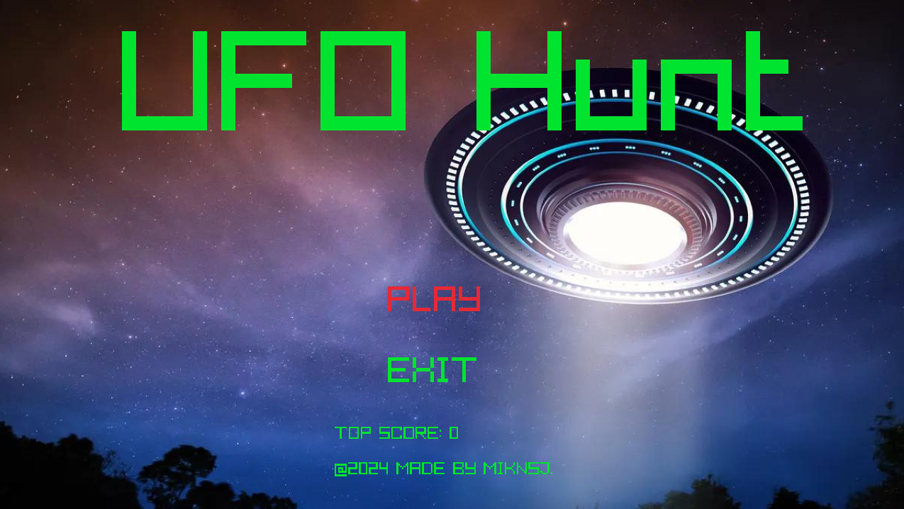
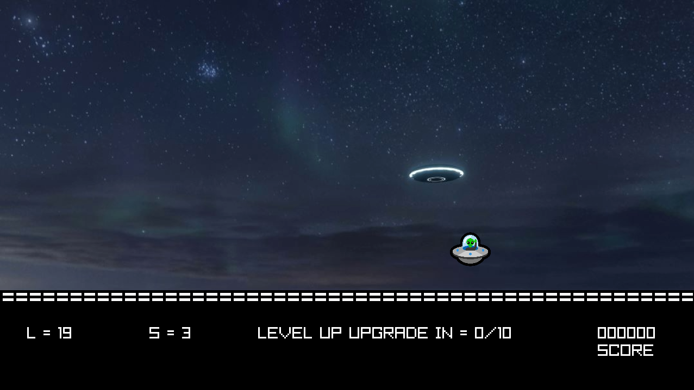

# UFO Hunt

## Overview
This is 2D-clicker game implemented using C and Raylib.

## Description
Space invaders have been spotted roaming around the perimeter of Earth. Due to
growing fear among the population, the government sends you on a solo mission
to aboard a rocket ship equiped with a powerful, armor penetrating blaster into
outer space. Your job is to eliminate these invaders in order to protect our
world.

## Video
Refer to the demo of this game 
[here](https://youtu.be/UOaZgamK6FA?si=Xj_gkiEFge2JqP4lj).

## Screenshots




## Contents
This section goes over the contents of this repository.

- ```assets```: Imported textures, sound, and music material.
- ```screenshots```: Pictures of the game.
- ```src```: Files to generate the game.
- ```videos```: Demo of the game.

## Setup
In this section, we are assuming the user has some basic knowledge of C and
raylib and has configured a working environment.

1. Download and link raylib libraries.
2. Compile game.c using the Makefile by executing the following command
```make``` in your terminal.
3. Run/play the game by executing the following command in your terminal
```./game```.

Now, you can play UFO Hunt!

## Controls
This section goes over the controls of UFO Hunt.

Menu

```W,A,S,D``` or ```Arrow keys```: scrolls menu options

```Enter``` or ```Left Mouse Click```: selects the menu option

Game

```Left Mouse Click```: shoots down ufo

```m```: goes back to the main menu

Both

```Esc``` or ```[x] symbol of window```: closes the window (game)

## Notes
- ```L = 25```: represents 25 lives
- ```S = 3```: represents the enemy ufo speed

## Bugs/Issues
- Hitmarkers may not appear when clicked on a UFO.

## Contributions
Tools

- WSL2 (Ubuntu 11.4.0)
- Vim + coc.nvim
- raylib v5.0

Assets

- [Raylib Docs](https://www.raylib.com/index.html)
- [UFO Sprite Image](https://emojipedia.org/microsoft/windows-10-fall-creators-update/flying-saucer)
- [Menu Background](https://www.foxnews.com/us/harvard-ufo-study-claiming-aliens-could-earth-disguised-humans-thought-experiment-expert-says)
- [Game Background](https://manhattan.institute/article/ufo-review-outer-space-the-inside-story)
- [Hitmarker Image](https://www.pngall.com/hit-marker-png/download/159891)
- [Bullet Fired Sound Effect](https://www.soundsnap.com/remington_m700s_sniper_rifle_firing_a_single_shot_02_wav_0)
- [Explosion Sound Effect](https://www.soundsnap.com/8bit_explosion_6_wav)
- [Menu Navigation Sound Effect](https://opengameart.org/content/gui-sound-effects)
- [Main Menu Theme](https://opengameart.org/content/space-station-1)
- [Game Theme](https://opengameart.org/content/through-space)
- [Game Over Theme](https://opengameart.org/content/game-over-trumpet-sfx)

## License
Established on June 2024 by MIKNSJ.
